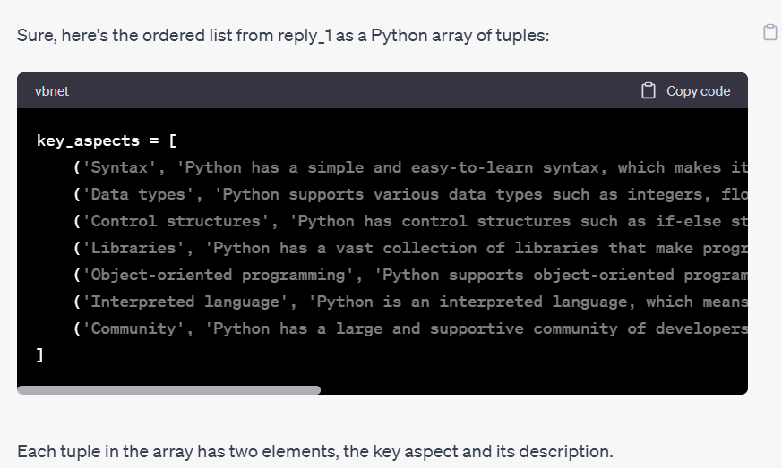
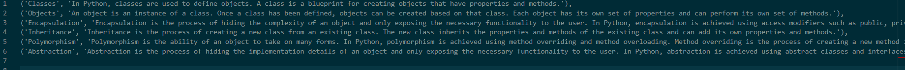

# Anki flashcard generator #
## Index ##
1. Project Description
2. Installation
3. Chat-GPT prompting
4. Use

## Project Description ##
This project consists of a python program that creates an anki flashard deck for a given topic. It uses requires an array of tuples provided by chat-GPT which it reads from a text file.
The user is required to prompt chat-GOT to provide a description of a topic in the form of an ordered list, each key aspect of the topic being a pont in the list with a description.
The python program reads the array from a text file and returns an anki deck, with each key point being a single flashcard.

## Installation ##
### Github ###
  1. clone the repository to your computer.
  2. open the command terminal in the project directory and run 'pip install -r requirements.txt'
  
 ## Chat-GPT prompting ##
 * In order to get the list of tuples, first get an ordered list:
  eg. "explain python for beginners giving descriptions for the most important aspects".
 *  Next request the list to be returned as an array of tuples, with the key aspects as the first element and the description as the second element of each tuple.
    
 * Copy the array into the subject_file.txt file. You must remove the variable name, "=" and "[]" signs from the copied text so there is only a set of tuples.
    
 The file reader module will then read this text file and return the tuples in the appropriate format for the deck generator.
 
 
  
 
